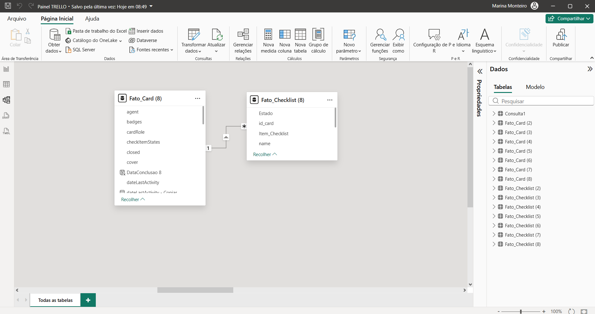
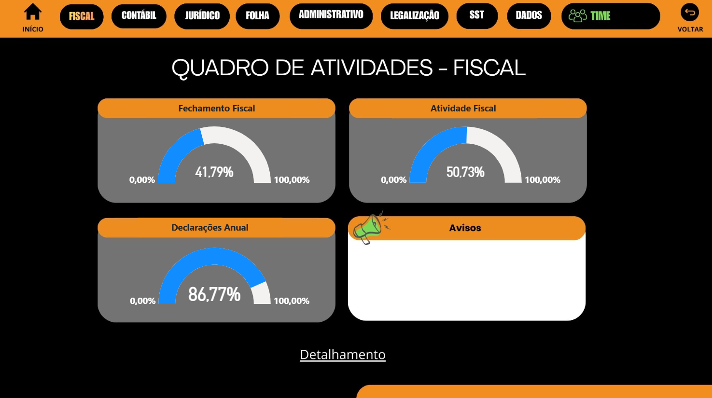
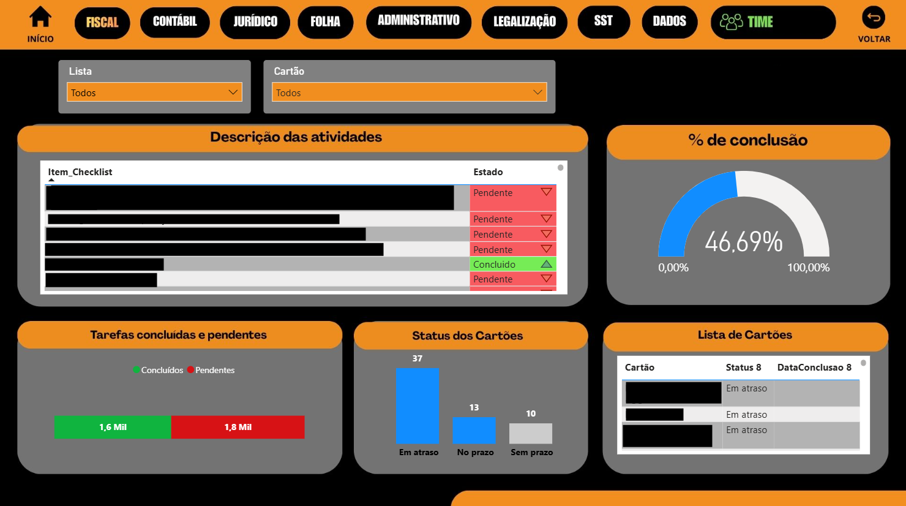

# trello-pbi-dashboard
Dashboard de KPIs de equipes com integração via API do Trello e Power BI.

📊 Dashboard de Produtividade: Integração Trello API & Power BI
Análise de KPIs de Equipes baseada em Fluxos de Trabalho (Checklists)

📌 Contexto do Projeto
Este projeto nasceu da necessidade de mensurar a eficiência operacional em um ambiente de gestão ágil. Utilizando a API do Trello, desenvolvi um pipeline de dados que extrai informações detalhadas de cartões e, especificamente, o progresso de checklists, transformando dados qualitativos de gestão em métricas quantitativas de desempenho.

🧠 Abordagem Metodológica

Diferente de dashboards comuns de "status", esta solução aplica conceitos de:
 - Análise de Fluxo (Throughput): Medição da vazão de itens concluídos por período.
 - Identificação de Gargalos: Aplicação de lógica de Lead Time para detectar etapas onde o processo perde tração.

🛠️ Arquitetura Técnica
 - Extração (ETL): Conexão via Web.Contents no Power Query para consumo dos endpoints da API do Trello (Boards, Cards e Checklists).
 - Tratamento de Dados: Uso de Linguagem M para expansão de estruturas JSON aninhadas e tratamento de paginação/limites da API.
 - Modelagem: Estrutura de dados otimizada para performance, garantindo a integridade dos relacionamentos 1:N entre cartões e sub-itens.
 - DAX Avançado: Criação de medidas para cálculo de taxas de conclusão (%).

📈 Principais KPIs Desenvolvidos
 - Índice de Conclusão de Checklists (ICC): Relação percentual entre itens planejados vs. executados.
 - Distribuição de Carga: Visualização do volume de micro-tarefas por responsável (em andamento)
 - Monitoramento de Backlog: Envelhecimento dos cartões sem movimentação de checklist (em andamento).

Este modelo foi adaptado para fluxos de fechamento contábil, garantindo que cada etapa do checklist de conformidade seja auditável em tempo real.



# 📊 Dashboard de Produtividade: Integração Trello API & Power BI


## 🔍 Visualização do Projeto

### Visão Geral (Quadro de Atividades)
Nesta tela, consolidamos os principais indicadores de entrega por setor, permitindo uma visão macro do status de conformidade.


### Detalhamento e Performance de Equipe
Análise granular por item de checklist, monitoramento de prazos e distribuição de tarefas concluídas vs. pendentes.



-----

## 💻 Implementação Técnica (Linguagem M)

Para garantir a transparência do processo de ETL, abaixo apresento o script principal utilizado para o consumo da API do Trello. Note o uso de `RelativePath` para otimização da segurança e performance no Power BI Service.

### 💻 Implementação Técnica: Extração de Cards (Linguagem M)

```powerquery
let
    // Conexão com a API do Trello utilizando RelativePath para garantir atualização no Service
    Fonte = Json.Document(
        Web.Contents(
            "[https://api.trello.com](https://api.trello.com)",
            [
                RelativePath = "1/boards/SEU_QUADRO/cards",
                Query = [
                    key = "SUA_CHAVE",
                    token = "SEU_TOKEN"
                ]
            ]
        )
    ),

    // Conversão de JSON para Tabela e Expansão Inicial
    #"Convertido para Tabela" = Table.FromList(Fonte, Splitter.SplitByNothing(), null, null, ExtraValues.Error),
    #"Column1 Expandido" = Table.ExpandRecordColumn(#"Convertido para Tabela", "Column1", 
        {"id", "closed", "dueComplete", "dateLastActivity", "desc", "due", "idBoard", "idList", "name"}, 
        {"id", "closed", "dueComplete", "dateLastActivity", "desc", "due", "idBoard", "idList", "name"}),

    // Tipagem dos Dados para garantir performance em cálculos DAX
    #"Tipo Alterado" = Table.TransformColumnTypes(#"Column1 Expandido", {
        {"id", type text}, 
        {"closed", type logical}, 
        {"dueComplete", type logical}, 
        {"dateLastActivity", type datetime}, 
        {"desc", type text}, 
        {"due", type datetime}, 
        {"idBoard", type text}, 
        {"idList", type text}, 
        {"name", type text}
    }),

    // Invocação de Função Personalizada para granularidade de Checklists
    #"Função Personalizada Invocada" = Table.AddColumn(#"Tipo Alterado", "Checklists", each fn_Checklists_Card([id], [name])),
    
    // Ajuste Final de Nomenclatura para o Modelo Star Schema
    #"Colunas Renomeadas" = Table.RenameColumns(#"Função Personalizada Invocada",{{"id", "id_card"}})
in
    #"Colunas Renomeadas"


